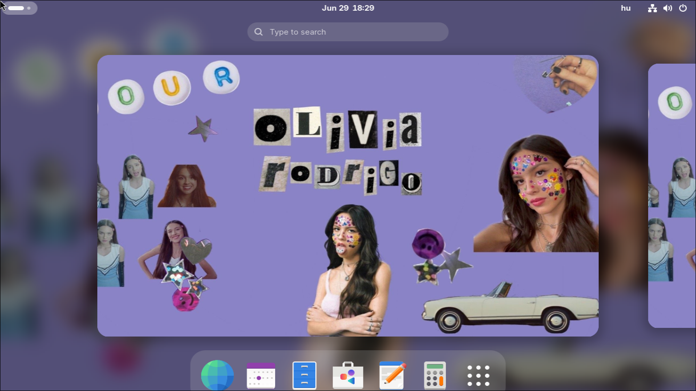

# Olivia Rodrigo Linux

> Arch-based live ISO with GNOME, Calamares installer, and a SOUR/GUTS aesthetic



[](https://github.com/Sandwich-GD/olivia-rodrigo-linux/releases)
[]()
[]()

---

## Features

- **Arch Linux** under the hood — full access to the AUR and Arch repos
- **GNOME** desktop with dark mode, purple accent, and Hungarian keymap pre-configured
- **Blur-my-Shell** extension enabled out of the box
- **Calamares** GUI installer — install to disk in minutes
- **NetworkManager** for easy WiFi and network management
- **Firefox**, **Extension Manager**, and all core GNOME apps included
- Works on UEFI and BIOS systems
- Live user `olivia` (password: `live`) with sudo access

## Download

Get the latest ISO from the [Releases page](https://github.com/Sandwich-GD/olivia-rodrigo-linux/releases).

### Verify

```sh
sha256sum olivia-rodrigo-linux-*.iso
```

## Quick Start

### Try in QEMU

```sh
qemu-system-x86_64 -enable-kvm -m 4096 -cdrom olivia-rodrigo-linux-*.iso
```

### Install to USB

```sh
sudo dd if=olivia-rodrigo-linux-*.iso of=/dev/sdX bs=4M status=progress && sync
```

### Install to Disk

Boot the ISO, launch Calamares from the desktop, and follow the installer.

## Building from Source

```sh
git clone https://github.com/Sandwich-GD/olivia-rodrigo-linux.git
cd olivia-rodrigo-linux
sudo mkarchiso -v -w /tmp/archiso-tmp -o out .
```

Requires `archiso` on an Arch-based system.

## Credits

- Inspired by Hannah Montana Linux (Noah Cagle) and Justin Bieber Linux
- Built with [archiso](https://github.com/archlinux/archiso)
- Desktop environment by [GNOME](https://www.gnome.org/)
